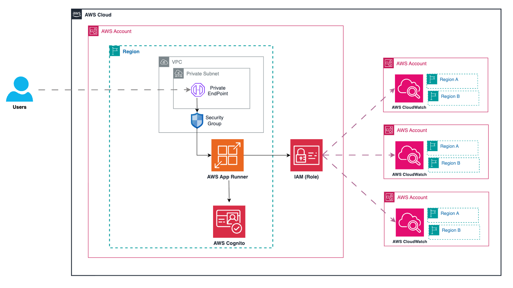
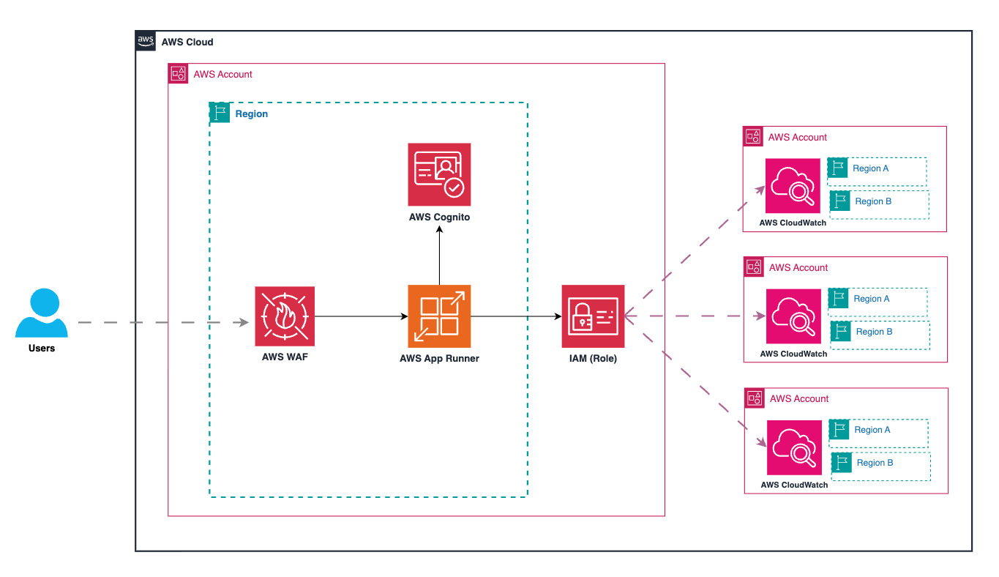

# DBCentral Monitoring Solution for AWS Database Services

> **Disclaimer:** This code is provided as reference code only and is intended for educational, demonstration, and learning purposes. It is not intended for direct production use without proper review, testing, and modification to meet your specific requirements and security standards. You are responsible for testing, securing, and optimizing the AWS Content, such as sample code, as appropriate for production grade use based on your specific quality control practices and standards. Deploying AWS Content may incur AWS charges for creating or using AWS chargeable resources, such as running Amazon App Runner, Cognito, Cloudwatch, DynamoDB.


## Content
- [1.- What is DBCentral Monitoring Solution ?](#section-1)
- [2.- How looks like ?](#section-2)
- [3.- Architecture and Deployment Options](#section-3)
- [4.- Solution Deployment](#section-4)
- [5.- Cost and Pricing](#section-5)


<a name="section-1"></a>
## 1.- What is DBCentral Monitoring Solution ?

DBCentral Monitoring Solution is a unified observability platform that consolidates monitoring for all your AWS database services into a single, powerful interface. It seamlessly integrates CloudWatch metrics with AWS metadata across multiple regions and accounts, providing comprehensive visibility that eliminates blind spots and reduces complexity. Unlike traditional monitoring approaches that require constant console-switching, DBCentral delivers real-time insights that enable your teams to proactively identify performance issues, optimize database operations, and maintain peak efficiency—all through one centralized monitoring hub designed specifically for AWS database environment


### Key features

- Complete Database Visibility - See all your database instances and clusters at once with simple dashboards that combine metrics and performance data in clear, meaningful displays.

- Cross-Region Monitoring - Track databases across AWS regions from one screen with visual maps showing replication status and performance at a glance.

- Multi-Account Management - Monitor instances and clusters from any AWS account without switching consoles, bringing your entire database fleet into a single, unified view.

- Smart Performance Visualization - Evaluate database health at a glance with our thoughtfully designed UI that presents key performance metrics in a clear, intuitive format for faster analysis and decision-making.


### Use cases

- #### Rapid Incident Response
When performance degrades, quickly pinpoint whether the issue lies in your database, network, or application layer. DBCentral Monitoring consolidates critical metrics on one screen, reducing troubleshooting time.

- #### Hands-On Database Learning
Demystify how databases actually work. See performance metrics in context, understand what each number really means for your workloads, and gain practical knowledge about database engine behavior through clear, real-time visualizations.

- #### Unified Cross-Region Visibility
Break down monitoring silos with our single-pane view of databases spanning multiple regions. Track replication status, compare performance across geographies, and ensure consistent operation of your global database footprint—all without switching between regional consoles.

- #### Cross-Account Observability
Monitor your entire database fleet regardless of AWS account boundaries. Gain comprehensive visibility across development, testing, and production environments in one unified interface, eliminating blind spots and providing complete organizational database awareness.

### Database engines supported

- Amazon Aurora DSQL
- Amazon DynamoDB (Coming Soon)
- Amazon MemoryDB & Elasticache (Coming Soon) 
- Amazon Aurora MySQL-Compatible & PostgreSQL-Compatible Edition (Coming Soon)
- Amazon DocumentDB (Coming Soon)


<a name="section-2"></a>
## 2.- How looks like ?


#### DBCentral Solution for Amazon Aurora DSQL


<a name="section-3"></a>
## 3.- Architecture and Deployment Options

### 3.1 Private deployment



The Private deployment of the DBCentral Monitoring Solution is designed for organizations requiring enhanced network security and isolation.
Key Components:

1.	Network Configuration
    - Deployed within a dedicated VPC
    - Uses Private Subnets for resource placement
    - Includes a Private Endpoint for secure internal access
    - Security Group controls traffic flow to App Runner service

2.	Frontend Service
    - AWS App Runner hosts the web application
    - Access is restricted through VPC Endpoint integration
    - Not directly exposed to the public internet

3.	Authentication
    - Amazon Cognito provides secure user authentication
    - API calls integrated with Cognito for authorization
    - User sessions are securely managed through Cognito tokens

4.	Backend Services
    - NodeJS API Service manages and routes API requests
    
5.	Cross-Account Access
    - IAM Roles enable secure cross-account access
    - Solution can manage resources across multiple AWS accounts
    - Principle of least privilege enforced throughout


#### Benefits:
- Enhanced security through network isolation
- Access restricted to users within the VPC or through VPC endpoints
- Reduced attack surface by eliminating direct internet exposure
- Complies with strict network security requirements
- Suitable for sensitive environments and regulated industries


### 3.2 Public deployment 




The Public deployment of the DBCentral Monitoring Solution provides easier accessibility while maintaining security controls.
Key Components:

1.	Network Configuration
    - Deployed with public accessibility
    - AWS Web Application Firewall (WAF) protects the application from common web threats
    - IP-based access controls via CIDR rules in WAF configuration

2.	Frontend Service
    - AWS App Runner hosts the web application
    - Directly accessible over the internet through WAF
    - WAF filters and protects against malicious traffic

3.	Authentication
    - Amazon Cognito provides secure user authentication
    - API calls integrated with Cognito for authorization
    - User sessions are securely managed through Cognito tokens

4.	Backend Services
    - NodeJS API Service manages and routes API requests

5.	Cross-Account Access
    - IAM Roles enable secure cross-account access
    - Solution can manage resources across multiple AWS accounts
    - Principle of least privilege enforced throughout

#### Benefits:
- Simplified accessibility from anywhere with internet access
- Web Application Firewall provides security for internet-facing resources
- IP filtering capabilities for controlled access
- Easier onboarding for users outside your corporate network
- Reduced network infrastructure complexity
- Suitable for less restrictive environments and broader user bases


 
<a name="section-4"></a>
## 4.- Solution Deployment

> **Time to deploy:** Approximately 10 minutes.

The deployment procedure consists of two main components:

- Application: Deploy the application infrastructure (public or private)
    - [4.1 Public Option](#section-4-1)
    - [4.2 Private option](#section-4-2)
- IAM Role: Create and configure IAM roles for remote accounts to enable cross-account observability when is required, this can be done using AWS CLI or AWS Cloudformantion.
    - [4.3.1 Using AWS CLI](#section-4-3-1)
    - [4.3.2  Using Cloudformation template](#section-4-3-2) 


<a name="section-4-1"></a>
### 4.1 Public Option


Follow these step-by-step instructions to configure and deploy the DBCentral Monitoring Solution into your AWS account using CloudFormation.

1. Download clodformation template ([cloudformation.public.yaml](https://raw.githubusercontent.com/aws-samples/sample-dbcentral-solution/refs/heads/main/conf/cloudformation.public.yaml))
    
2. Sign in to the AWS Management Console
    - Navigate to the AWS Console (https://console.aws.amazon.com )
    - Sign in with your credentials

3. Navigate to the AWS CloudFormation service
    - From the AWS Console, search for "CloudFormation" in the search bar
    - Click on the CloudFormation service


4. Start Stack Creation
    - Click the "Create stack" button
    - Select "With new resources (standard)"


5. Specify Template Source
    - Choose "Upload a template file"
    - Click "Choose file" and select your CloudFormation template file
    - Click "Next"

6. Specify Stack Details
    - Enter a meaningful name for the stack in the "Stack name" field (e.g., "dbcentral-solution")


7. Configure General Configuration Parameters
    - GitHubRepositoryUrl: Enter the HTTPS URL for your GitHub repository where the DBCentral Monitoring Solution code is stored
    - AppUser: Enter the email address that will be used for the application user (e.g., admin@example.com )

8. Configure Network and Security Parameters
    - WAFRequired: Select "true" if you want to enable AWS WAF protection, or "false" to disable it
    - IPv4CIDR: (Optional, required only if WAF is enabled) Enter the IPv4 CIDR range that should be allowed access (e.g., 192.168.1.0/24)
    - IPv6CIDR: (Optional, required only if WAF is enabled) Enter the IPv6 CIDR range that should be allowed access (e.g., 2605:59c8:731d:4810:415:bd81:f251:f260/128)


9. Configure Stack Options (Optional)
    - Add any tags to help identify and manage your stack resources
    - Configure advanced options if needed (notifications, stack policy, rollback configuration, etc.)
    - Click "Next"

10. Review Stack Configuration
    - Review all the parameters and settings for your stack
    - Scroll down and check the acknowledgment box that states "I acknowledge that AWS CloudFormation might create IAM resources with custom names"
    - Click "Create stack"

11. Monitor Stack Creation
    - The CloudFormation console will display the stack creation status
    - View the "Events" tab to monitor the progress and troubleshoot any issues
    - Wait until the stack status changes to "CREATE_COMPLETE"

12. Access Stack Outputs
    - Once the stack creation is complete, navigate to the "Outputs" tab
    - Here you'll find important information such as the URL to access the frontend application
    - Log in using the provided application user email (you may receive temporary credentials via email)


<a name="section-4-2"></a>
### 4.2 Private Option


Follow these step-by-step instructions to configure and deploy the DBCentral Monitoring Solution into your AWS account using CloudFormation.


1. Download clodformation template ([cloudformation.private.yaml](https://raw.githubusercontent.com/aws-samples/sample-dbcentral-solution/refs/heads/main/conf/cloudformation.private.yaml))

2. Sign in to the AWS Management Console
    - Navigate to the AWS Console (https://console.aws.amazon.com )
    - Sign in with your credentials


3. Navigate to the AWS CloudFormation service
        - From the AWS Console, search for "CloudFormation" in the search bar
        - Click on the CloudFormation service


4. Start Stack Creation
    - Click the "Create stack" button
    - Select "With new resources (standard)"

5. Specify Template Source
    - Choose "Upload a template file"
    - Click "Choose file" and select your CloudFormation template file
    - Click "Next"

6. Specify Stack Details
    - Enter a meaningful name for the stack in the "Stack name" field (e.g., "dbcentral-solution")

7. Configure General Configuration Parameters
    - GitHubRepositoryUrl: Enter the HTTPS URL for your GitHub repository where the DBCentral Monitoring Solution code is stored
    - AppUser: Enter the email address that will be used for the application user (e.g., admin@example.com )


8. Configure Network and Security Parameters
    - VPCId: Select the VPC ID where you want to deploy the App Runner service
    - SubnetId: Select the Subnet ID for the App Runner VPC Connector
    - IPv4CIDR: Enter the IPv4 CIDR range that should be allowed access through AWS Security Group (e.g., 192.168.1.0/24)
    - IPv6CIDR: Enter the IPv6 CIDR range that should be allowed access through AWS Security Group (e.g., 2605:59c8:731d:4810:415:bd81:f251:f260/128)

9. Configure Stack Options (Optional)
    - Add any tags to help identify and manage your stack resources
    - Configure advanced options if needed (notifications, stack policy, rollback configuration, etc.)
    - Click "Next"


10. Review Stack Configuration
    - Review all the parameters and settings for your stack
    - Scroll down and check the acknowledgment box that states "I acknowledge that AWS CloudFormation might create IAM resources with custom names"
    - Click "Create stack"


11. Monitor Stack Creation
    - The CloudFormation console will display the stack creation status
    - View the "Events" tab to monitor the progress and troubleshoot any issues
    - Wait until the stack status changes to "CREATE_COMPLETE"


12. Access Stack Outputs
    - Once the stack creation is complete, navigate to the "Outputs" tab
    - Here you'll find important information such as the URL to access the frontend application
    - Save or note down these output values for future reference

13. Verify Deployment
    - Once the stack creation is complete, navigate to the "Outputs" tab
    - Here you'll find important information such as the URL to access the frontend application
    - Log in using the provided application user email (you may receive temporary credentials via email)


### 4.3 IAM Role Deployment

If the monitoring process needs to be performed across multiple AWS accounts (which is the most common scenario), you will need to deploy a cross-account IAM role to access those accounts.

Role will grant following permissions to get access resources on remote accounts.

```
{
    "Version": "2012-10-17",
    "Statement": [
        {
            "Sid": "VisualEditor0",
            "Effect": "Allow",
            "Action": [
                "dsql:ListClusters",
                "dsql:ListTagsForResource",
                "dsql:GetCluster",
                "cloudwatch:GetMetricData"
            ],
            "Resource": "*"
        }
    ]
}
```

<a name="section-4-3-1"></a>
- #### 4.3.1 Using AWS CLI 

This approach will create this role using AWS CLI on your target account to be monitored.

Note : Update <YOUR-CENTRAL-DEPLOYMENT-ACCOUNT> with your central account where application was deployed.
```bash
aws iam create-role --role-name IAMRoleDBCentralSolution --assume-role-policy-document '{"Version":"2012-10-17","Statement":[{"Effect":"Allow","Principal":{"AWS":"arn:aws:iam::<YOUR-CENTRAL-DEPLOYMENT-ACCOUNT>:role/IAMRoleDBCentralSolutionOrigin"},"Action":"sts:AssumeRole"}]}' && aws iam put-role-policy --role-name IAMRoleDBCentralSolution --policy-name policy-dbcentral --policy-document '{"Version":"2012-10-17","Statement":[{"Sid":"VisualEditor0","Effect":"Allow","Action":["dsql:ListClusters","dsql:ListTagsForResource","dsql:GetCluster","cloudwatch:GetMetricData"],"Resource":"*"}]}'
```


<a name="section-4-3-2"></a>
- #### 4.3.2 Using Cloudformation template

This approach will deploy this role as an AWS CloudFormation StackSet from your management account.

1. Download clodformation template ([cloudformation.iam.role.yaml](https://raw.githubusercontent.com/aws-samples/sample-dbcentral-solution/refs/heads/main/conf/cloudformation.iam.role.yaml))

2.	Sign in to the AWS Management Console.
3.	Navigate to the AWS CloudFormation service.
4.	Click on StackSets on the left-side menu.
5.	Click on Create StackSet.
6.	In the "Choose template" screen, select Service-managed permissions.
7.	Specify Template Source
    - Choose "Upload a template file" 
    - Click "Choose file" and select your CloudFormation template (cloudformation.iam.role.yaml)    
    - Click "Next"
8.	Enter a name for the StackSet in the "StackSet name" field.
9.	In the "RoleARN" field enter the role ARN that was created during the the first template deployment (found in the Outputs section).
10.	Click Next.
11.	In the “Set deployment options” select Deploy new stacks.
12.	Under the “Deployment targets” section select the option that fits best for the deployment.
13.	Under "Specify regions," select only one region (e.g., US East - N. Virginia).
Note: Since this CloudFormation StackSet only deploys an IAM role, which is a global service, selecting multiple regions will cause deployment errors. The StackSet will attempt to deploy the same IAM role in each region, leading to failures.
15.	Under "Deployment options," set Failure tolerance to 1. Important: This setting is crucial because the StackSet will attempt to redeploy the existing role in the original account. If the tolerance is not set to 1, the entire deployment will fail.
16.	In the "Review" screen, verify that all the parameters are correct.
17.	Select the I acknowledge that AWS CloudFormation might create IAM resources with custom names checkbox.
18.	Click Submit.


<a name="section-5"></a>
## 5.- Cost & Pricing


### AWS Apps Runner
- Daily compute resources used to process requests
    - 8 hrs × 1 active container instance × [(1 vCPU × $0.064 vCPU-hour) + (2 GB × $0.007 GB-hour)] - 8 hrs x 1 provisioned container instance x (2 GB × $0.007 GB-hour) = $0.51

- Daily provisioned container instance fee
    - 24 hrs × 1 provisioned container instance × (2 GB × $0.007 GB-hour) = $0.34

- Total daily cost
    - Total compute resources ($0.51) + provisioned container instance ($0.34) = $0.85

- Total monthly cost
    - Total daily cost ($0.85) × 30 days = $25.50


### AWS Cognito
- Basic feature used by this solution of Cognito is under free tier.


### AWS Cloudwatch
- Cost will depend how much this applicaition is used and how many resources are being actively monitoring. 
    - GetMetricData call price is $0.01 per 1,000 metrics requested. Cluster monitoring will gather 15 metrics per call every 20 seconds. 15 metrics x 3 ( 20 seconds x 3 = 1 minute) = 45 metrics per minute x 60 = 2,700 metrics per hour. 2,700 / 1,000 = 2.7 * $0.01 = 0.027 DLS per cluster per hour. 


## Security

See [CONTRIBUTING](CONTRIBUTING.md#security-issue-notifications) for more information.


## License

This library is licensed under the MIT-0 License. See the [LICENSE](LICENSE.txt) file.

